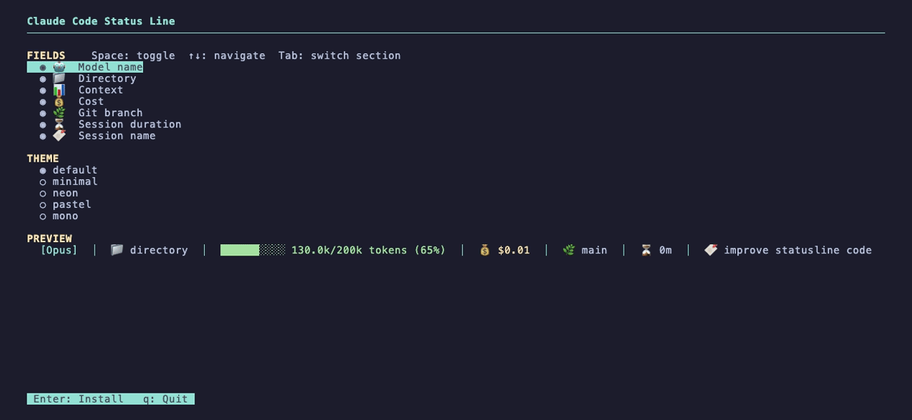

# ccsl — Claude Code Status Line

Terminal configurator for [Claude Code](https://claude.ai/code)'s built-in status line. Pick fields, pick a theme, hit Enter.



## What it does

Writes a tiny Python script to `~/.claude/statusline.py` and wires it into `~/.claude/settings.json`. Claude Code calls that script on every prompt and renders the output as your status line.

**Fields**

| Field           | Example                        |
| --------------- | ------------------------------ |
| 🤖 Model        | `[Opus]`                       |
| 📁 Directory    | `📁 directory`                 |
| 📊 Context      | `██████░░░░ 130k/200k (65%)`   |
| 💰 Cost         | `💰 $0.01`                     |
| 🌿 Git branch   | `🌿 main`                      |
| ⏳ Duration     | `⏳ 0m`                        |
| 🔖 Session name | `🔖 improve statusline code`   |

**Themes:** `default` · `minimal` · `neon` · `pastel` · `mono`

## Requirements

- Python 3 (standard library only, no pip install)
- Claude Code

## Usage

**Quick install:**

```bash
curl -fsSL https://raw.githubusercontent.com/jsubroto/claude-code-statusline/main/ccsl.py -o /tmp/ccsl.py && python3 /tmp/ccsl.py && rm /tmp/ccsl.py
```

**Or clone and run:**

```bash
git clone https://github.com/jsubroto/claude-code-statusline.git
cd claude-code-statusline
python3 ccsl.py
```

Navigate with **↑ ↓**, toggle fields with **Space**, switch sections with **Tab**, install with **Enter**, quit with **q**.

Restart Claude Code after installing to see your status line.

## Testing

```bash
python3 -m unittest test_ccsl -v
```

## License

MIT

## Uninstall

Remove the `statusLine` key from `~/.claude/settings.json`. A backup is saved to `~/.claude/settings.json.bak` before every install.
